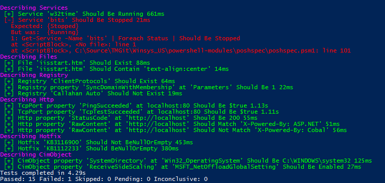

# PoshSpec
An infrastructure testing DSL running in Pester. The goal is to expand the Pester DSL to assist in the development of infrastructure validation scripts.

## Install from the Gallery
```powershell
PS> Install-Module -Name poshspec
```

## Example 
```powershell
Describe 'Services' {    
    Service w32time Status { Should Be Running }
    Service bits Status { Should Be Stopped }
}

Describe 'Files' {
    File C:\inetpub\wwwroot\iisstart.htm { Should Exist }
    File C:\inetpub\wwwroot\iisstart.htm { Should Contain 'text-align:center' }
}

Describe 'Registry' {
    Registry HKLM:\SOFTWARE\Microsoft\Rpc\ClientProtocols { Should Exist }
    Registry HKLM:\SYSTEM\CurrentControlSet\Services\Tcpip\Parameters\ "SyncDomainWithMembership" { Should Be 1  }
    Registry 'HKLM:\SOFTWARE\Callahan Auto\' { Should Not Exist }
}

Describe 'Http' {
    TcpPort localhost 80 PingSucceeded { Should Be $true }
    TcpPort localhost 80 TcpTestSucceeded { Should Be $true }
    Http http://localhost StatusCode { Should Be 200 }
    Http http://localhost RawContent { Should Match 'X-Powered-By: ASP.NET' }
    Http http://localhost RawContent { Should Not Match 'X-Powered-By: Cobal' }
}
Describe 'Hotfix' {
    Hotfix KB3116900 { Should Not BeNullOrEmpty}
    Hotfix KB1112233 { Should BeNullOrEmpty}
}
Describe 'CimObject' {
    CimObject Win32_OperatingSystem SystemDirectory { Should Be C:\WINDOWS\system32 }
    CimObject root/StandardCimv2/MSFT_NetOffloadGlobalSetting ReceiveSideScaling { Should Be Enabled }
}
Describe 'WebSite' {
   WebSite TestSite protocol { Should be "http" }
   WebSite TestSite bindingInformation { Should match '80' }
   WebSite TestSite sslFlags { Should be 0 }
   WebSite TestSite state { Should be 'Started' }
   Website TestSite physicalPath { Should be 'C:\IIS\Files\TestSite' } 
   CheckAppPool TestSite { Should be $True}
   AppPoolState TestSite { Should be Started } 
}
```



## Functions

Here is a list of implemented functions.

`File [-Path] <string> [-Should] <scriptblock>`

_Verify the existence of a file and optionally validate its contents with a regex pattern._

`Hotfix [-Id] <string> [-Should] <scriptblock>`

_Verify a particular Hotfix/Update is installed_

`Http [-Uri] <string> [[-Property] <string> {BaseResponse | Content | Headers | RawContent | RawContentLength | RawContentStream | StatusCode | StatusDescription}] [-Should] <scriptblock>`

_Verify a Uri returns a 200 StatusCode and optionally validate RawContent._

`Registry [-Path] <string> [[-Property] <string>] [-Should] <scriptblock>`

_Verify a registry key exists and optionally validate the value of a given property._

`Service [-Name] <String> [-Property] <String> [-Should] <ScriptBlock>`

_Verify a service is in a given state. Default is "Running"._

`TcpPort [-Address] <string> [-Port] <string> [[-Property] <string> {AllNameResolutionResults | BasicNameResolution | ComputerName | Detailed | DNSOnlyRecords | InterfaceAlias | InterfaceDescription | InterfaceIndex | IsAdmin | LLMNRNetbiosRecords | MatchingIPsecRules | NameResolutionSucceeded | NetAdapter | NetRoute | NetworkIsolationContext | PingReplyDetails | PingSucceeded | RemoteAddress | RemotePort | SourceAddress | TcpClientSocket | TcpTestSucceeded | TraceRoute}] [-Should] <scriptblock>`

_Verify that a specific TCP port is listening._

`CimObject [-ClassName] <string> [-Property] <string> [-Should] <scriptblock>`

_Verify that a CimObject exists and optionally validate the value of a given property. The function will try to parse out Namespace and Class if the Class parameter is provied in the form of `namespace\class`._

## Creating New Test Functions

*Every test must implement a few bits of logic.*

**It must have two properties**: `[string]$Target` and `[scriptblock]$Should`. It can optionally implement `[string]$Property` and `[string]$Qualifier`. If your function has any more than those 4 parameters, it will likely break unless you take special measures to deal with them.

- **Target** is the name or unique identifier of object you are testing.
- **Should** is the assertion using [Pester Should syntax](https://github.com/pester/Pester/wiki/Should).
- **Property** could be used to test a Property of the *Target*.
- **Qualifier** could be used to filter the *Target* or *Property*.

**It must call `Get-TestParam` with at least the following properties.**

- **TestName** is the type of test. i.e. File, Service
- **TestExpression** is a scriptblock that will be executed to get an object to test.
- **@PSBoundParameters** Splat the PSBoundParameters automatic variable.

Optionally, you may pass a **FriendlyName** parameter. This is used when generating the Pester **It** Name as a way to prettify the output when the **Target** is a particularly long string.

**It must pass the output of `Get-TestParam` to `Invoke-PoshspecExpression`**

It's easiest way to do this is with [splatting](https://technet.microsoft.com/en-us/library/jj672955.aspx).